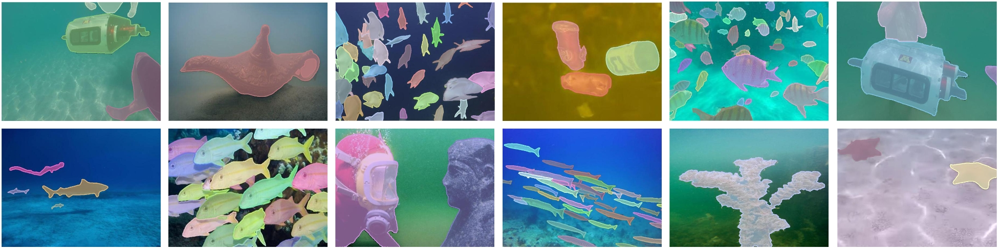

# UIIS10K
[](https://github.com/LiamLian0727/UIIS10K/issues)
[]()
[](https://github.com/LiamLian0727/UIIS10K/stargazers)
[](https://huggingface.co/datasets/LiamLian0727/USIS10K)
[](https://arxiv.org/abs/2505.15581)
[](LICENSE)

This repository is the official implementation of "[Taming SAM for Underwater Instance Segmentation and Beyond](https://arxiv.org/abs/2505.15581)".

If you found this project useful, please give us a star ⭐️ or [cite](#citation) us in your paper, this is the greatest support and encouragement for us.

## :speech_balloon: Updates
🚩 **News** (2025.05) We propose a large-scale underwater instance segmentation dataset, [**UIIS10K**](#datasets), which includes **10,048 images** with pixel-level annotations for 10 categories. As far as we know, this is **the largest underwater instance segmentation dataset** available and can be used as a benchmark for evaluating underwater segmentation methods.

  

## Datasets
The dataset follows the COCO format and is organized as follows:
```
    data
      ├── UIIS10K
      |   ├── annotations
      │   │   ├── multiclass_train.json
      │   │   ├── multiclass_test.json
      │   ├── img
      │   │   ├── train_00001.jpg
      │   │   ├── ...
      │   │   ├── test_00001.jpg
      │   │   ├── ...
```
you can get our UIIS10K dataset in [Hugging Face](https://huggingface.co/datasets/LiamLian0727/UIIS10K/tree/main), [Baidu Disk](https://pan.baidu.com/s/1WwDu_jYV8JsPvOGA2l6raQ?pwd=UIIS) (pwd:UIIS), or [Google Drive](https://drive.google.com/file/d/1MYQwWrQW_n9N-q_VPMuQaroIp5gS2f-u/view?usp=sharing).

## Code
Code is coming soon

### Citation
If you find our repo useful for your research, please cite us:
```
@InProceedings{UIIS_Dataset_2023,
    author    = {Shijie Lian, Hua Li, Runmin Cong, Suqi Li, Wei Zhang, Sam Kwong},
    title     = {WaterMask: Instance Segmentation for Underwater Imagery},
    booktitle = {Proceedings of the IEEE/CVF International Conference on Computer Vision (ICCV)},
    month     = {October},
    year      = {2023},
    pages     = {1305-1315}
}

@article{UIIS10K_Dataset_2025,
    author    = {Hua Li, Shijie Lian, Zhiyuan Li, Runmin Cong, Chongyi Li},
    title     = {Taming SAM for Underwater Instance Segmentation and Beyond},
    year      = {2025},
    journal   = {arXiv preprint arXiv:2505.15581},
}
```

## ⭐ Stargazers
[](https://github.com/LiamLian0727/UIIS10K/stargazers)
